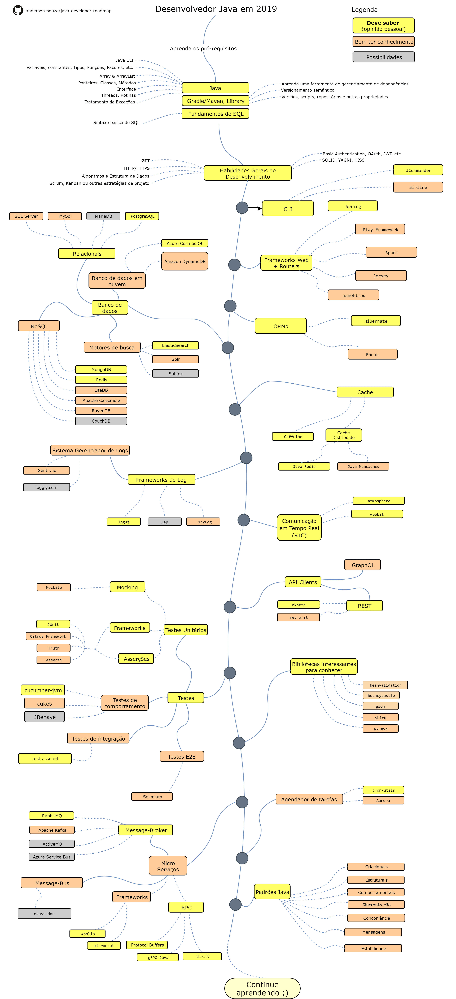

# Roteiro Desenvolvedor Java

> Roteiro para se tornar um Desenvolvedor [Java](https://g.co/kgs/bzeRda) em 2019:

<a href="#">/a>

Abaixo você conseguirá encontrar um gráfico demonstrando os caminhos que você pode tomar e as bibliotecas que você deve aprender para se tornar um desenvolvedor Java. Este gráfico foi feito com o intuído de servir como dica para todos aqueles que perguntam “o que devo aprender em seguida como
desenvolvedor Java?

## Aviso

> O propósito deste roteiro é te dar uma ideia do panorama geral. O roteiro apenas te guiará se estiver confuso sobre o que aprender em seguida, não será encorajado apenas aprender aquilo que está na moda. Você deve compreender o motivo de uma ferramenta ser melhor do que outras em alguns
> casos, e lembre-se que o que está na moda nem sempre é o melhor para o trabalho.
>
> Estes gráficos foram desenvolvidos originalmente por [Sakib Sami](https://github.com/s4kibs4mi), eu apenas fiz a tradução para **Português** (pt-br) com o intuito de auxiliar aqueles que não dominam a leitura da língua inglesa.

## Dê uma estrela! :star:

Se você gostou ou está utilizando este projeto para aprender o iniciar seu aprendizado, considere dar uma estrela no repositório. Obrigado!

## Roteiro

## Recursos

1. Pré-requisitos

   - [Java](https://www.java.com/en/download/)
   - [Gradle](https://gradle.org/)
   ou [Maven](https://maven.apache.org/)
   - [SQL](https://www.w3schools.com/sql/default.asp)

2. Habilidades Gerais de Desenvolvimento

   - Aprenda GIT, crie alguns repositórios no GitHub, compartilhe seus códigos com outras pessoas.
   - Aprenda o protocolo HTTP(S), métodos request (GET, POST, PUT, PATCH, DELETE, OPTIONS)
   - Não sinta medo em utilizar o Google
   - Leia alguns livros sobre Algoritmos e Estrutura de Dados
   - Aprenda a implementar uma autenticação básica
   - Aprenda princípios de SOLID, etc

3. CLI Tools
   1. [args4j](http://args4j.kohsuke.org/)
   2. [JCommander](http://jcommander.org/)
   3. [airline](https://github.com/airlift/airline)

4. Frameworks Web + Routers

   1. [Spring](https://spring.io/)
   2. [Play Framework](https://www.playframework.com/)
   3. [Spark](http://sparkjava.com/)
   4. [Jersey](https://jersey.github.io/)
   5. [nanohttpd](https://github.com/NanoHttpd/nanohttpd)

5. Banco de dados

   1. Relacionais
      1. [SQL Server](https://www.microsoft.com/en-us/sql-server/sql-server-2017)
      2. [PostgreSQL](https://www.postgresql.org/)
      3. [MariaDB](https://mariadb.org/)
      4. [MySQL](https://www.mysql.com/)
      5. [Oracle](https://www.oracle.com/database/)
   2. Banco de dados em nuvem
      - [CosmosDB](https://docs.microsoft.com/en-us/azure/cosmos-db)
      - [DynamoDB](https://aws.amazon.com/dynamodb/)
   3. Motores de busca
      - [ElasticSearch](https://www.elastic.co/)
      - [Solr](http://lucene.apache.org/solr/)
      - [Sphinx](http://sphinxsearch.com/)
   4. NoSQL
      - [MongoDB](https://www.monJavadb.com/)
      - [Redis](https://redis.io/)
      - [Apache Cassandra](http://cassandra.apache.org/)
      - [LiteDB](https://github.com/mbdavid/LiteDB)
      - [RavenDB](https://github.com/ravendb/ravendb)
      - [CouchDB](http://couchdb.apache.org/)

6. ORMs

   1. [Hibernate](https://hibernate.org/)
   2. [Ebean](https://ebean.io/)
   3. [BelleORM](https://github.com/codersgarage/BelleORM)

7. Cache

   1. [Caffeine](https://github.com/ben-manes/caffeine)
   2. [EHCache](http://www.ehcache.org/)
   3. [Cache2k](https://cache2k.org/)
   4. Cache distribuído
      1. [Java-Redis](https://github.com/xetorthio/jedis)
      2. [Java-Memcached](https://redislabs.com/lp/memcached-java/)
      3. [Infinispan](http://infinispan.org/)

8. Logs

   1. Frameworks de Log
      - [Zap](https://github.com/uber-Java/zap)
      - [TinyLog](http://www.tinylog.org/)
      - [log4j](https://logging.apache.org/log4j)
   2. Sistema Gerenciador de Logs
      - [Sentry.io](http://sentry.io)
      - [Loggly.com](https://loggly.com)
      - [Tracer](https://github.com/zalando/tracer)

9. Comunicação em Tempo Real (RTC)
   1. [Socket.IO](https://socket.io/)
   2. [atmosphere](https://github.com/Atmosphere/atmosphere)
   3. [webbit](https://github.com/webbit/webbit)

10. API Clients

    1. REST
       - [okhttp](https://square.github.io/okhttp/)
       - [retrofit](https://square.github.io/retrofit/)
    2. [GraphQL](https://graphql.org/)

11. Interessante saber

    - [Beanvalidation](https://beanvalidation.org/)
    - [bouncycastle](https://www.bouncycastle.org/java.html)
    - [gson](https://github.com/google/gson)
    - [Apache Shiro](https://shiro.apache.org/)
    - [JJWT](https://github.com/jwtk/jjwt)
    - [RxJava](https://github.com/ReactiveX/RxJava)

12. Testes

    1. Unidade, Comportamento, Integração, Teste de Carga
       1. [JUnit](http://junit.org/)
       2. [CitrusFramework](https://citrusframework.org/)
       3. [Gatling](https://gatling.io/)
       4. [Tsung](http://tsung.erlang-projects.org/)
       5. [Mockito](https://site.mockito.org/)
       6. [Truth](https://github.com/google/truth)
       7. [Assertj](https://joel-costigliola.github.io/assertj)
       8. [cucumber-jvm](https://github.com/cucumber/cucumber-jvm)
       9. [cukes](https://github.com/ctco/cukes)
       10. [hoverfly-java](https://github.com/SpectoLabs/hoverfly-java)
       11. [rest-assured](https://github.com/rest-assured/rest-assured)
       12. [jbehave](https://jbehave.org/)
    2. Testes E2E
       - [Selenium](https://github.com/tebeka/selenium)

13. Agendamento de Tarefas

    - [Aurora](https://aurora.apache.org/)
    - [elasticjob](https://github.com/elasticjob/elastic-job-lite)
    - [Sundial](https://github.com/knowm/Sundial)
    - [cron-utils](https://github.com/jmrozanec/cron-utils)

14. Micro Serviços

    1. Message-Broker
       - [RabbitMQ](https://www.rabbitmq.com/tutorials/tutorial-one-javascript.html)
       - [Apache Kafka](https://www.npmjs.com/package/kafka-node)
       - [ActiveMQ](https://github.com/apache/activemq)
       - [Azure Service Bus](https://docs.microsoft.com/en-us/azure/service-bus-messaging/service-bus-messaging-overview)
    2. Message-Bus
       - [mbassador](https://github.com/bennidi/mbassador)
       - [rmq](https://github.com/xetorthio/rmq)
    3. Frameworks
         - [Apollo](https://spotify.github.io/apollo/)
         - [lagom-framework](https://www.lightbend.com/lagom-framework)
         - [micronaut](https://micronaut.io/)
         - [eureka](https://github.com/Netflix/eureka)
         - [helidon](https://helidon.io/#/)
         - [armeria](https://github.com/line/armeria)
    4. RPC
         - [Protocol Buffers](https://github.com/protocolbuffers/protobuf)
         - [gRPC-Java](https://github.com/grpc/grpc-java)
         - [thrift](https://thrift.apache.org/)

15. [Java-Patterns](https://github.com/iluwatar/java-design-patterns)

## Fique Ligado

Se você acredita que este repositório pode ser melhorado, por favor abra um Pull Request com qualquer atualização e submeta um issue.

Ideia obtida de: [Golang Developer Roadmap](https://github.com/Alikhll/golang-developer-roadmap)

## Contribuição

Este roteiro foi criado utilizando o [Draw.io](https://www.draw.io/). O arquivo do projeto pode ser encontrado em `java-developer-roadmap.xml.` Para modificá-lo, abra o draw.io, clique em “**Open Existing Diagram**” e escolha o arquivo xml do projeto. Isso abrirá o roteiro para você. Atualize o roteiro, faça o upload e atualize a imagem no readme e crie um Pull Request (exporte a imagem em PNG com 400% de zoom e reduza o tamanho da imagem com o [Compressor.io](https://compressor.io/compress)).

- Abra um Pull Request com melhorias
- Discuta ideias nos issues
- Espalhe a palavra

## Licença

